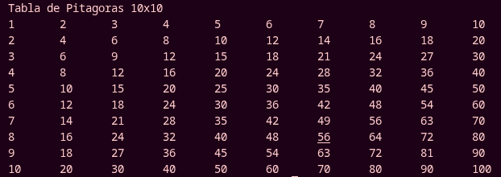

# Actividad 4 — Tabla de Pitágoras en Matriz

---

## Introducción

## Descripción de la actividad

Desarrollar una **aplicación en Python** que muestre una **tabla de Pitágoras interactiva** para facilitar la multiplicación de dos factores ingresados por el usuario. El programa debe almacenar la tabla en una **lista de listas (matriz)**, imprimirla en pantalla de forma ordenada y permitir que el usuario capture dos factores (renglón y columna) para obtener su producto consultando directamente la información almacenada en la matriz.

---

## Definiciones

Se define la función `construir_tabla(tamaño)` que genera la tabla de Pitágoras como una lista de listas. El ciclo `for` externo recorre los renglones y el ciclo `for` interno construye cada fila, agregándola a la matriz con `append()`.

```python
def construir_tabla(tamaño=10):
    tabla = []
    for renglon in range(1, tamaño + 1):
        fila = []
        for columna in range(1, tamaño + 1):
            fila.append(renglon * columna)
        tabla.append(fila)
    return tabla
```

---

## Función sin retorno de valor

La función `imprimir_tabla(tabla)` recorre la matriz y muestra cada fila con los números tabulados (`\t`). Al no usar `return`, la función solo imprime la tabla en pantalla.

```python
def imprimir_tabla(tabla):
    for fila in tabla:
        print("\t".join(str(numero) for numero in fila))
        
```

## Consultar Producto

---

## Programa principal

Se construye la matriz y se llama a la función sin valor para imprimir la tabla completa:

```python
tabla = construir_tabla()
print("Tabla de Pitagoras 10x10")
imprimir_tabla(tabla)
```

---

## Salidas esperadas

La siguiente salida muestra la tabla de Pitágoras sin corchetes ni comas, con cada número separado por tabulaciones:



---
