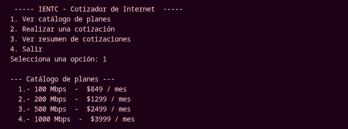
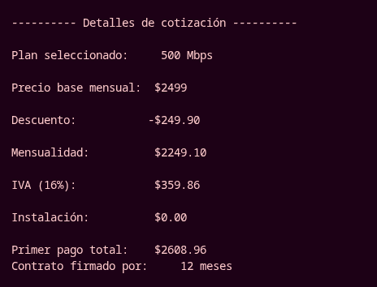
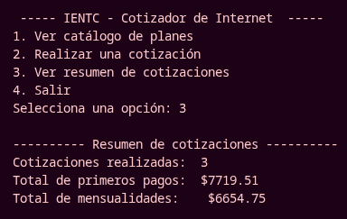
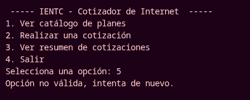

# Avance de Proyecto — Sistema de Cotización de Internet Empresarial IENTC

Dentro de esta rama se detalla el avance del proyecto (Fase I) para la **Actividad 3** del curso *Solución de problemas con programación computacional*.

---

## Introducción

Esta documentación describe el diseño y análisis de un sistema de **cotización de planes de internet empresarial** para la empresa de telecomunicaciones **IENTC**.

En este avance se realiza el análisis de la problemática identificada en el área comercial de la organización, se delimitan las reglas de negocio que rigen la cotización de los servicios, se clasifican los datos que intervienen en la solución, se identifican los operadores y estructuras de control necesarios, y se desarrolla un prototipo funcional en Python que ejecuta el proceso de cotización en consola. El objetivo es definir de manera clara cómo debe funcionar el sistema antes de llegar a las etapas posteriores del proyecto, asegurando que se cumplan los requerimientos planteados y facilitando su comprensión.

## Análisis organizacional

**IENTC Telecomunicaciones** es una empresa mexicana de telecomunicaciones fundada en 2011, autorizada como Red Pública de Telecomunicaciones por el IFT. Cuenta con aproximadamente **300 colaboradores** y una infraestructura de más de **25,000 kilómetros de fibra óptica** a nivel nacional, con interconexiones internacionales en Europa y Asia, así como seis centros de datos distribuidos en el país.

Su oferta de servicios se enfoca principalmente en el mercado empresarial: **internet de alta velocidad por fibra óptica**, telefonía fija, conectividad corporativa, servicios *carrier* y soluciones en la nube. La empresa diseña paquetes personalizados para cada cliente y garantiza un nivel de disponibilidad del 99.9%.

El área de impacto seleccionada es el **área comercial y de ventas**, que atiende a clientes corporativos que solicitan cotizaciones de planes de internet. Las cotizaciones actualmente se elaboran de forma manual, lo que provoca errores en la aplicación de descuentos, en el cálculo de la instalación y del IVA, así como demoras en la atención al cliente.

## Definición del problema

Le empresa necesita agilizar la elaboración de cotizaciones y reducir errores de cálculo al ofrecer sus planes de internet empresarial. El problema técnico a resolver es la **ausencia de una herramienta que estandarice el proceso de cotización**: el precio mensual, el costo de instalación, los descuentos por tipo de cliente y por plazo de contrato, y el IVA se calculan de forma manual dentro del área comercial.

La solución propuesta es un **sistema de cotización en consola** que reciba el plan elegido por el cliente, el plazo del contrato y su condición de cliente nuevo, y que entregue por pantalla un desglose detallado del primer pago y de la mensualidad, acumulando además las cotizaciones realizadas durante la sesión para apoyar la proyección de ventas del área.

## Reglas de negocio

El sistema se rige por las siguientes reglas de negocio, delimitadas a partir de la operación actual del área comercial:

- Existen **cuatro planes base** de internet empresarial (100, 200, 500 y 1000 Mbps), cada uno con un precio mensual estandarizado.
- La **instalación** tiene un costo único; este se **condona** cuando el cliente firma un contrato de 12 o 24 meses.
- Los **clientes nuevos** reciben un **10% de descuento** sobre el precio mensual durante el primer semestre.
- Los clientes con contrato de **24 meses** reciben un **5% adicional** de descuento, el cual se suma al descuento anterior.
- Sobre la mensualidad ya descontada se aplica el **IVA del 16%**.
- El **primer pago** está formado por la mensualidad descontada, más su IVA, más el costo de instalación (si aplica).
- El sistema permite elaborar **múltiples cotizaciones** en una misma sesión y acumula los montos para generar un resumen al final.

## Requisitos funcionales

Para garantizar el funcionamiento básico del sistema de cotización se definen los siguientes requisitos funcionales:

1. El sistema debe mostrar el catálogo de planes de internet disponibles con su velocidad y precio mensual.

2. El sistema debe permitir al usuario elegir un plan de los cuatro disponibles en el catálogo.

3. El sistema debe capturar el plazo del contrato, aceptando únicamente las duraciones de 0, 12 o 24 meses.

4. El sistema debe identificar si el cliente es nuevo para aplicar el descuento de bienvenida del primer semestre.

5. El sistema debe calcular el descuento total según las reglas de negocio del cliente y el plazo del contrato.

6. El sistema debe aplicar la condonación de instalación cuando el contrato sea de 12 o 24 meses.

7. El sistema debe calcular la mensualidad, el IVA y el primer pago, mostrando el desglose completo en pantalla.

8. El sistema debe acumular las cotizaciones de la sesión y mostrar un resumen con el total de los primeros pagos y las mensualidades.

## Requisitos no funcionales

Asimismo, el sistema debe cumplir con los siguientes requisitos no funcionales:

1. El sistema debe ser fácil de usar, mediante un menú sencillo y opciones claras en consola.

2. El sistema debe validar los datos ingresados, rechazando planes o plazos de contrato no válidos e indicando el error al usuario.

3. El sistema debe ser eficiente, permitiendo elaborar varias cotizaciones en una misma sesión sin reiniciar el proceso.

4. El sistema debe ser escalable, facilitando la incorporación de nuevos planes, clientes registrados y reportes a futuro.

5. El sistema debe ser de bajo costo de ejecución, corriendo únicamente en consola sin requerir dependencias externas.

---

## Modelo Entrada-Proceso-Salida (EPS)

El sistema sigue el modelo **Entrada-Proceso-Salida**:

- **Entrada:** la opción del menú, el número del plan, los meses de contrato y la respuesta de si el cliente es nuevo.
- **Proceso:** selección del plan, aplicación de descuentos, condonación de instalación, cálculo de la mensualidad, del IVA y del primer pago, y acumulación de los totales de la sesión.
- **Salida:** catálogo de planes, detalle de cada cotización y resumen final de la sesión.

## Clasificación de Datos

| Variable | Tipo de dato | Descripción |
| :--- | :--- | :--- |
| `opcion` | `str` | Opción del menú seleccionada por el usuario. |
| `clave` | `int` | Número del plan elegido (1 a 4). |
| `meses` | `int` | Meses de contrato (0, 12 o 24). |
| `nuevo` | `str` | Respuesta (s/n) de si el cliente es nuevo. |
| `velocidades` / `precios` | `list` | Catálogo de velocidades en Mbps y precios mensuales. |
| `costo_instalacion` | `int` | Costo único de instalación en MXN. |
| `iva` | `float` | Porcentaje de IVA (0.16). |
| `desc_bienvenida` / `desc_contrato_24` | `float` | Porcentajes de descuento (0.10 y 0.05). |
| `precio_plan`, `velocidad_plan` | `int` | Precio y velocidad del plan seleccionado. |
| `descuento` | `float` | Monto total del descuento aplicado. |
| `mensualidad`, `iva_aplicado`, `primer_pago`, `instalacion` | `float` | Resultados del proceso de cobro. |
| `num_cotizaciones` | `int` | Contador de cotizaciones realizadas. |
| `total_primeros_pagos`, `total_mensualidades` | `float` | Acumuladores de montos de la sesión. |

## Operadores del Lenguaje

**Operadores matemáticos:**
- `*` para calcular el monto del descuento, el IVA y las sumas porcentuales (por ejemplo `mensualidad * iva`).
- `-` para restar el descuento del precio base y obtener la mensualidad con descuento.
- `+` para sumar mensualidad, IVA e instalación, y para acumular los totales de la sesión.

**Operadores relacionales:**
- `1 <= clave <= 4` para validar que el plan elegido exista dentro del catálogo.
- `meses == 0 or meses == 12 or meses == 24` para validar el plazo del contrato.
- `meses >= 12` para definir si la instalación queda condonada.
- `meses == 24` y `nuevo.lower() == "s"` para decidir qué descuentos se aplican.

**Operadores lógicos:**
- `or` para permitir varios valores válidos en la validación del plazo del contrato.
- Se mantiene la estructura `if/elif/else` con condiciones excluyentes para que solo se ejecute el bloque correcto.

## Estructuras de Control

**Estructuras condicionales:**
- `if/elif/else`: dirigen el menú principal, validan la clave del plan y el plazo del contrato, deciden la condonación de la instalación, aplican los descuentos según el cliente y el plazo, y controlan el switch de las opciones del menú.

**Estructuras iterativas:**
- `while`: mantiene el programa activo hasta que el usuario selecciona la opción de salir.
- `while` de validación: solicita repetidamente el plan o el plazo del contrato hasta que el valor ingresado sea válido.
- `for` con `range`: recorre la lista del catálogo para mostrar los planes disponibles en pantalla.

---

## Documentación del diseño

El diseño del sistema de cotización se realizó con el objetivo de mantener una estructura clara y alineada al proceso real del área comercial de IENTC, siendo fácil de comprender y de ampliar en fases posteriores.

Se definieron **constantes** para los valores estandarizados del negocio, lo que centraliza las tarifas y permite modificarlas sin alterar el resto del programa. El catálogo se representó con dos **listas paralelas** que almacenan la velocidad y el precio de cada plan, las cuales se recorren con el ciclo `for` para mostrarlas en pantalla.

La lógica central se divide en tres momentos que corresponden al modelo EPS: la captura de entradas con **validación mediante ciclos `while`**, el **proceso de cálculo** con estructuras `if/elif/else` que garantizan que los descuentos se apliquen en el orden correcto y de forma excluyente, y la **salida** del detalle de la cotización. Finalmente, los **acumuladores** de la sesión permiten generar un resumen que apoya la proyección de ventas del área comercial.

El uso de confirmaciones excluyentes (`if` para cliente nuevo, `if` para contrato de 24 meses) evita cálculos dobles y mantiene la coherencia de las reglas de negocio, de manera similar a como se controlan descuentos únicos por boleto en actividades anteriores.

## Conclusión

En este avance se presentó el análisis y diseño de un sistema de **cotización de planes de internet empresarial** para IENTC Telecomunicaciones, identificando el problema del área comercial, delimitando las reglas de negocio, y definiendo los requerimientos funcionales y no funcionales, la clasificación de datos, los operadores y las estructuras de control necesarios. La aplicación del modelo Entrada-Proceso-Salida y del prototipo en Python permitió representar de manera clara el funcionamiento del sistema antes de su etapa final. Este diseño servirá como base para ampliar la solución en fases posteriores del proyecto.

---

## Prototipo de código

El prototipo funcional se encuentra en el archivo `semana-3/avance-proyecto/prototipo_inicial.py`. A continuación se documenta su lógica por bloques.

### catálogo de planes

Se declaran tarifas y porcentajes estandarizados del negocio, así como el catálogo de planes mediante listas paralelas:

```python
costo_instalacion = 1500
iva = 0.16
desc_bienvenida = 0.10
desc_contrato_24 = 0.05

velocidades = [100, 200, 500, 1000]
precios = [849, 1299, 2499, 3999]
```

### Menú principal con ciclo `while`

El menú se mantiene activo hasta que el usuario elige la opción de salida. Dentro del menú, el ciclo `for` recorre el catálogo para mostrarlo en pantalla:

```python
while True:
    print("\n ----- IENTC - Cotizador de Internet  ----- ")
    print("1. Ver catálogo de planes")
    print("2. Realizar una cotización")
    print("3. Ver resumen de cotizaciones")
    print("4. Salir")
    opcion = input("Selecciona una opción: ")
```

### Validación de entradas con `while`

El plan y el plazo del contrato se piden en ciclos de validación; si el valor no es válido, el ciclo se repite:

```python
while True:
    clave = int(input("Elige el plan (1-4): "))
    if 1 <= clave <= 4:
        break
    print("Error, plan no válido, prueba de nuevo.")

while True:
    meses = int(input("Meses de contrato (0, 12 o 24): "))
    if meses == 0 or meses == 12 or meses == 24:
        break
    print("Error, solo se aceptan contratos de 0, 12 o 24 meses.")
```

### Cálculo de descuentos, instalación e IVA

Las siguientes estructuras condicionales aplican los descuentos de forma independiente y acumulable: un cliente nuevo recibe el 10%, y un contrato de 24 meses añade el 5%. La instalación se condona cuando el contrato alcanza 12 o más meses:

```python
descuento = 0
if nuevo.lower() == "s":
    descuento = precio_plan * desc_bienvenida

if meses == 24:
    descuento = descuento + precio_plan * desc_contrato_24

instalacion = costo_instalacion
if meses >= 12:
    instalacion = 0

mensualidad = precio_plan - descuento
iva_aplicado = mensualidad * iva
primer_pago = mensualidad + iva_aplicado + instalacion
```

### Salida del detalle y acumulación

Cada cotización muestra su desglose completo y actualiza los acumuladores de la sesión:

```python
print("\n---------- Detalles de cotización ----------")
print(f"\nPlan seleccionado:     {velocidad_plan} Mbps")
print(f"\nPrecio base mensual:  ${precio_plan}")
print(f"\nDescuento:           -${descuento:.2f}")
print(f"\nMensualidad:          ${mensualidad:.2f}")
print(f"\nIVA (16%):            ${iva_aplicado:.2f}")
print(f"\nInstalación:          ${instalacion:.2f}")
print(f"\nPrimer pago total:    ${primer_pago:.2f}")

total_primeros_pagos += primer_pago
total_mensualidades += mensualidad
num_cotizaciones += 1
```

### Depuración con PDB

Durante el desarrollo de esta actividad se depuró con **PDB** un error lógico en el orden de cálculo del IVA. En una versión anterior, el IVA se calculaba sobre el **precio base sin descuento**, por lo que el cargo resultaba mayor al real. Con `import pdb; pdb.set_trace()` se inspeccionaron los valores de `precio_plan`, `descuento` y `mensualidad`, confirmando así que el IVA debe calcularse sobre la **mensualidad ya descontada**:

```python
mensualidad = precio_plan - descuento  
iva_aplicado = mensualidad * iva      
```

### Código completo

```python
costo_instalacion = 1500    
iva = 0.16                  
desc_bienvenida = 0.10      
desc_contrato_24 = 0.05     

velocidades = [100, 200, 500, 1000]
precios = [849, 1299, 2499, 3999]

total_primeros_pagos = 0
total_mensualidades = 0
num_cotizaciones = 0

while True:
    print("\n ----- IENTC - Cotizador de Internet  ----- ")
    print("1. Ver catálogo de planes")
    print("2. Realizar una cotización")
    print("3. Ver resumen de cotizaciones")
    print("4. Salir")
    opcion = input("Selecciona una opción: ")

    if opcion == "1":

        print("\n--- Catálogo de planes ---")
        for i in range(len(velocidades)):
            print(f"  {i + 1}.- {velocidades[i]} Mbps  -  ${precios[i]} / mes")

    elif opcion == "2":
        print("\n--- Nueva cotización ---")
        for i in range(len(velocidades)):
            print(f"  {i + 1}. {velocidades[i]} Mbps  -  ${precios[i]} / mes")

        while True:
            clave = int(input("Elige el plan (1-4): "))
            if 1 <= clave <= 4:
                break
            print("Error, plan no válido, intenta de nuevo.")

        indice = clave - 1
        velocidad_plan = velocidades[indice]
        precio_plan = precios[indice]

        while True:
            meses = int(input("Meses de contrato (0, 12 o 24): "))
            if meses == 0 or meses == 12 or meses == 24:
                break
            print("Error, solo se aceptan contratos de 0, 12 o 24 meses.")

        nuevo = input("¿Es cliente nuevo? (s/n): ")

        descuento = 0
        if nuevo.lower() == "s":
            descuento = precio_plan * desc_bienvenida

        if meses == 24:
            descuento = descuento + precio_plan * desc_contrato_24

        instalacion = costo_instalacion
        if meses >= 12:
            instalacion = 0

        mensualidad = precio_plan - descuento
        iva_aplicado = mensualidad * iva
        primer_pago = mensualidad + iva_aplicado + instalacion

        print("\n---------- Detalles de cotización ----------")
        print(f"\nPlan seleccionado:     {velocidad_plan} Mbps")
        print(f"\nPrecio base mensual:  ${precio_plan}")
        print(f"\nDescuento:           -${descuento:.2f}")
        print(f"\nMensualidad:          ${mensualidad:.2f}")
        print(f"\nIVA (16%):            ${iva_aplicado:.2f}")
        print(f"\nInstalación:          ${instalacion:.2f}")
        print(f"\nPrimer pago total:    ${primer_pago:.2f}")
        if meses > 0:
            print(f"Contrato firmado por:     {meses} meses")

        total_primeros_pagos += primer_pago
        total_mensualidades += mensualidad
        num_cotizaciones += 1

    elif opcion == "3":

        print("\n---------- Resumen de cotizaciones ----------")
        print(f"Cotizaciones realizadas:  {num_cotizaciones}")
        print(f"Total de primeros pagos:  ${total_primeros_pagos:.2f}")
        print(f"Total de mensualidades:    ${total_mensualidades:.2f}")

    elif opcion == "4":
        print("Gracias por usar el programa.")
        break

    else:
        print("Opción no válida, intenta de nuevo.")
```

--- 

## Salidas esperadas

### Consulta de planes



### Cotización realizada


### Resumen de cotizaciones



### Control de errores


